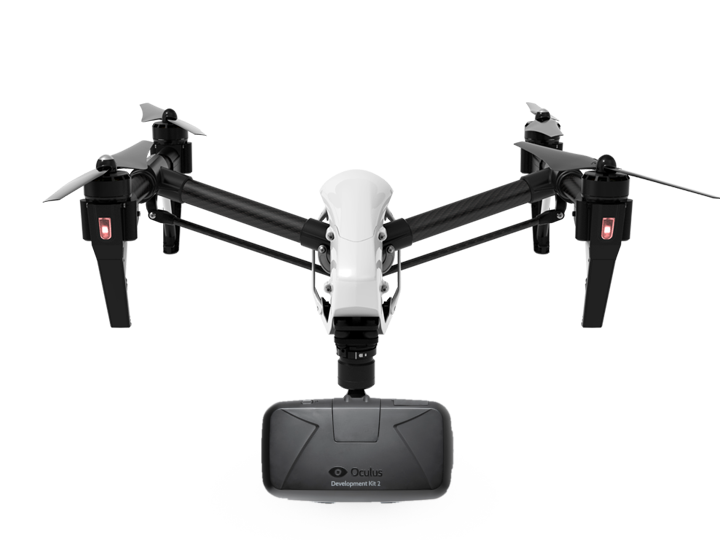
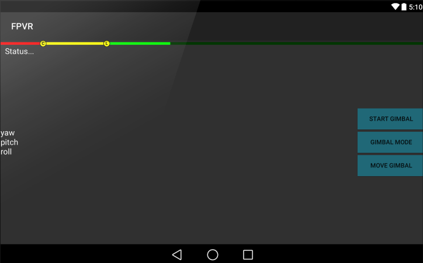

# FPVR

The goal of this project is to support First Person View flight (and driving) with VR Headsets.

FPVR is not just a simple video player. On supported platforms the camera gimbal can be controlled with a turn of the head. FPVR also provides a virtual environment and virtual Heads-Up Display for aircraft telemetry. Not only does this allow for future expansion (like virtual cockpits), it also addresses gimbal lag and virtually eliminates the motion sickness many experience when wearing headsets like a FatShark or Sony HMZ.

The first headset supported is the Oculus DK2 and the first aircraft supported is the DJI Inspire 1. However, the virtual environment is written in Unity 3D and vehicle telemetry and gimbal control is handled by an extensible plugin system. This flexibility will allow virtually any headset, vehicle and gimbal system to be supported in time.

#Piloting
The piloting interface is modeled after DJIs Pilot app. Piloting is still a work in progress but we already have a functional battery indicator with low and critical stages and the ability to control the camera gimbal with a connected Android controller. As with everything else, both of these features are implemented entirely using interfaces. They're working today with the Inspire 1 but can work with any vehicle or aircraft.

